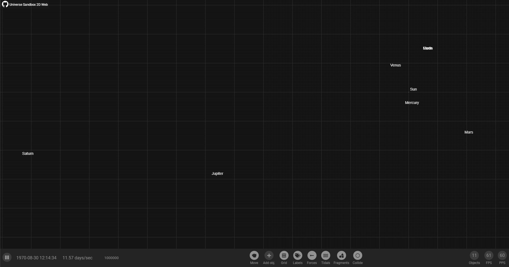
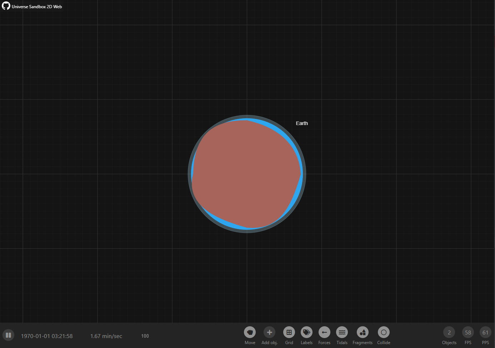
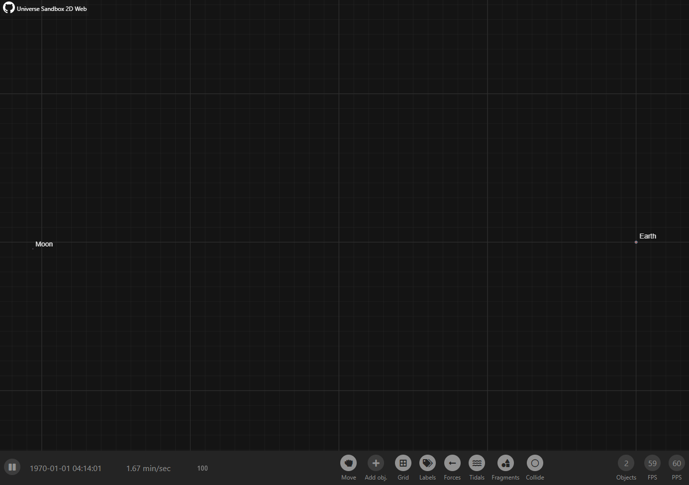
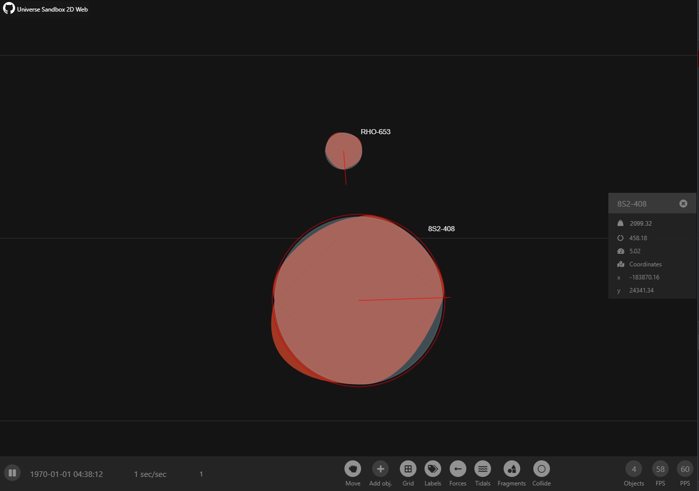

# Universe Sandbox 2D Web
> version 0.3.0

### Live

Live here - [Universe-Sandbox](https://universe-sandbox.it-efrem.com/) 

### What can you do

Universe Sandbox 2D Web allows you to:

- Create space objects with different masses (mouse wheel)
- Set direction vector
- Space objects are physically correctly attracted
- Space objects are physically correctly collide
- Track motion vector of objects
- The camera tracks objects

### ToDo

- Engine optimisations
- React optimisations
- Background space
- Fragments
- Light and shade
- Object types (planet, star, moon, black hole, ...)
- Textures
- Object rotations
- Tidal forces
- General menu
- Menu animations
- WebGL draw
- Web Worker physics

### Screenshots

### Description

Universe Sandbox 2D Web is an interactive space sandbox gravity simulator video game and educational software. Using Universe Sandbox 2D Web, users can see the effects of gravity on objects in the universe and run scale simulations of the Solar System, various galaxies or other simulations, while at the same time interacting and maintaining control over gravity, time, and other objects in the universe, such as moons, planets, asteroids, comets, and black holes. Universe Sandbox 2D Web available for Windows, macOS, and Linux as web-application.
